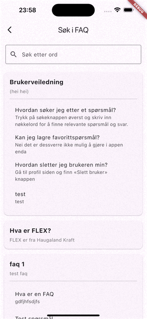

# Brukerveiledning for FAQ-appen

Denne veiledningen gir en oversikt over hovedsider og funksjoner i FAQ-appen. Hver seksjon viser en kort forklaring og et eksempelbilde.

---

  

    <h2>FAQ</h2>
  

  <table>
    <tr>
      <td><b>FAQ-liste</b> Viser oversikt over alle FAQ-temaer. Trykk på et tema for å se spørsmål og svar.</td>
      <th></th>
    </tr>
    <tr>
      <td><b>Søk</b> Søkefelt for å finne tema, spørsmål eller svar. Resultatene oppdateres mens du skriver.</td>
      <th></th>
    </tr>
    <tr>
      <td><b>Vis spørsmål & svar</b> Viser alle spørsmål og svar for valgt tema i en oversiktlig liste.</td>
      <th></th>
    </tr>
  </table>

  

    <h2>Spør AI</h2>
  

  <table>
    <tr>
      <td>Still spørsmål til en AI og få svar direkte i appen. Skriv inn spørsmålet ditt og få et generert svar.</td>
      <th></th>
    </tr>
  </table>

  

    <h2>Profil</h2>
  

  <table>
    <tr>
      <td>Viser brukerens navn og e-post. Her kan du logge ut eller slette brukeren din.</td>
      <th></th>
    </tr>
  </table>

  

    <h2>Admin-portal</h2>
  

  <table>
    <tr>
      <td>(Kun for admin) Opprett, rediger eller slett FAQ-temaer og spørsmål. Gir tilgang til avanserte redigeringsmuligheter.</td>
      <th></th>
    </tr>
  </table>

